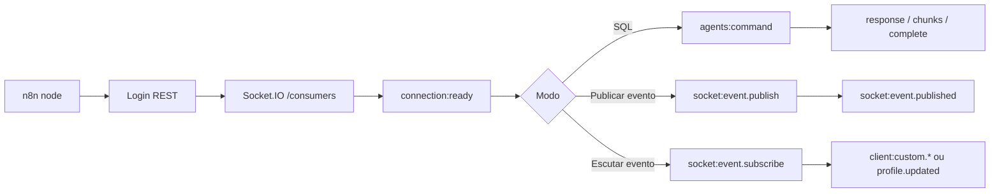

# Socket no Plug Database

Esta pasta documenta a superfície Socket do pacote `n8n-nodes-plug-database`.

O pacote expõe Socket de três formas:

- `Plug Database` com `Resource = SQL` e `Channel = Socket` para executar comandos Plug pelo namespace `/consumers`.
- `Plug Database` com `Resource = Tools` para publicar ou aguardar eventos `client:custom.*`.
- `Plug Database Socket Event Trigger` para escutar eventos de forma contínua enquanto o workflow está ativo.

Todos os fluxos autenticados usam a credencial `Plug Database Account API`. Os campos `User`, `Password`, `Default Agent ID`, `Default Client Token`, `Payload Signing Key` e `Payload Signing Key ID` vêm da mesma credencial global.

## Arquivos

- [SQL Via Socket](./sql-socket.md): execução de SQL, batch, fallback e modos de resposta.
- [Eventos Customizados](./custom-events.md): publicar eventos, aguardar um evento e limites de payload/anexos.
- [Socket Event Trigger](./socket-event-trigger.md): trigger contínuo, reconnect, backpressure, deduplicação e segurança.
- [PayloadFrame](./payload-frame.md): envelope usado no Socket, gzip e assinatura HMAC.
- [Exemplos](./examples.md): exemplos práticos de envio, escuta inline, trigger e SQL via Socket.
- [Troubleshooting](./troubleshooting.md): sintomas, códigos de erro e ações recomendadas.

## Quando Usar Cada Opção

Use `Channel = REST` quando quiser a opção mais compatível para comandos normais. Use `Channel = Socket` quando precisar de streaming, menor latência de ida e volta ou quando o servidor/agent já estiver otimizado para `agents:command`.

Use `Publish Socket Event` quando um workflow precisa avisar outro consumidor Plug sobre uma mudança. O canal REST é o padrão compatível; o canal Socket evita uma chamada HTTP extra quando o workflow já deve publicar pelo `/consumers`.

Use `Wait for Socket Event` quando a espera por um único evento faz parte de uma execução normal do workflow. Essa operação abre o socket, assina um evento exato, espera o primeiro match e fecha.

Use `Plug Database Socket Event Trigger` quando o workflow deve ficar ativo aguardando eventos indefinidamente. O trigger gerencia reconnect, fila local, deduplicação opcional e fechamento limpo.

## Namespace e Eventos

Todos os fluxos Socket usam o namespace `/consumers`.

Eventos de comando:

- `connection:ready`
- `agents:command`
- `agents:command_response`
- `agents:command_stream_chunk`
- `agents:command_stream_complete`
- `agents:stream_pull`
- `agents:stream_pull_response`

Eventos customizados:

- `socket:event.publish`
- `socket:event.published`
- `socket:event.subscribe`
- `socket:event.subscribed`
- `socket:event.unsubscribe`
- `socket:event.unsubscribed`
- `client:custom.*`
- `client:agent.profile.updated`

Fluxo resumido:

## Segurança e Dados Sensíveis

Não registre em log payloads completos, SQL, tokens, senhas, `clientToken`, `Payload Signing Key`, anexos em base64 ou headers de autenticação. A implementação só expõe metadados seguros em `json.__plug`, como canal, operação, socket id, `requestId`, contadores e status de entrega.

Para validar integridade de eventos recebidos, configure `Payload Signing Key` na credencial e habilite `Require Payload Signature` no listener ou trigger. Quando `Payload Signing Key ID` estiver preenchido, frames assinados precisam usar o mesmo `key_id`.
