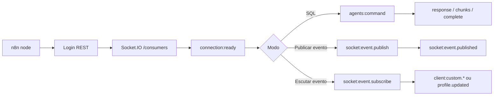

# Socket no Plug Database

Esta pasta documenta a superfície Socket do pacote `n8n-nodes-plug-database`.

O pacote expõe Socket de três formas:

- `Plug Database` com `Resource = SQL` e `Channel = Socket` para executar comandos Plug pelo namespace `/consumers`.
- `Plug Database` com `Resource = Tools` para publicar ou aguardar eventos `client:custom.*`.
- `Plug Database Socket Event Trigger` para escutar eventos de forma contínua enquanto o workflow está ativo.

Todos os fluxos autenticados usam a credencial `Plug Database Account API`. Os campos `User`, `Password`, `Default Agent ID`, `Default Client Token`, `Payload Signing Key` e `Payload Signing Key ID` vêm da mesma credencial global.

A documentação desta pasta está em **português**, exceto [implementation notes](./implementation-notes.md) (**inglês**), onde estão caminhos `shared/`, contratos TypeScript e notas para quem altera o código do monorepo.

## Arquivos

- [Glossário](./glossary.md): termos Socket reutilizados nos guias.
- [SQL Via Socket](./sql-socket.md): execução de SQL, batch, fallback e modos de resposta.
- [Eventos Customizados](./custom-events.md): publicar eventos, aguardar um evento e limites de payload/anexos.
- [Socket Event Trigger](./socket-event-trigger.md): trigger contínuo, reconnect, backpressure, deduplicação e segurança.
- [PayloadFrame](./payload-frame.md): envelope usado no Socket, gzip e assinatura HMAC.
- [Exemplos](./examples.md): exemplos práticos de envio, escuta inline, trigger e SQL via Socket (inclui [workflows JSON](./examples/) verificados pelo migrador).
- [Troubleshooting](./troubleshooting.md): sintomas, códigos de erro e ações recomendadas.
- [Implementation notes](./implementation-notes.md) (EN): contratos partilhados, helpers de sessão e limites operacionais do repositório.

## Quando usar cada opção

| Objetivo                                       | Onde configurar                                                               |
| ---------------------------------------------- | ----------------------------------------------------------------------------- |
| SQL com menor latência ou stream               | `Plug Database > SQL`, `Channel = Socket` ([SQL via Socket](./sql-socket.md)) |
| SQL mais compatível / servidores antigos       | `Channel = REST` (mesmo doc)                                                  |
| Avisar outros consumidores (`client:custom.*`) | `Tools > Publish Socket Event` ([Eventos customizados](./custom-events.md))   |
| Esperar um único evento na mesma execução      | `Tools > Wait for Socket Event` ([Eventos customizados](./custom-events.md))  |
| Escuta contínua com fila e reconnect           | [Socket Event Trigger](./socket-event-trigger.md)                             |

## Namespace e Eventos

Todos os fluxos Socket usam o namespace `/consumers`.

Eventos de comando:

- `connection:ready`
- `agents:command`
- `agents:command_response`
- `agents:command_stream_chunk`
- `agents:command_stream_complete`
- `agents:stream_pull`
- `agents:stream_pull_response`

Eventos customizados:

- `socket:event.publish`
- `socket:event.published`
- `socket:event.subscribe`
- `socket:event.subscribed`
- `socket:event.unsubscribe`
- `socket:event.unsubscribed`
- `client:custom.*`
- `client:agent.profile.updated`

Fluxo resumido:

## Segurança e dados sensíveis

Não registe SQL, payloads completos, tokens, senhas, chaves de assinatura nem anexos em base64 em logs externos. Em saída, use `Include Plug Metadata` para `json.__plug` seguro (ver [Troubleshooting](./troubleshooting.md#socket-diagnostico-saida)).

Integridade dos frames: [PayloadFrame — assinatura HMAC](./payload-frame.md#assinatura-hmac) e tabela em [Troubleshooting](./troubleshooting.md#socket-troubleshoot-hmac).
