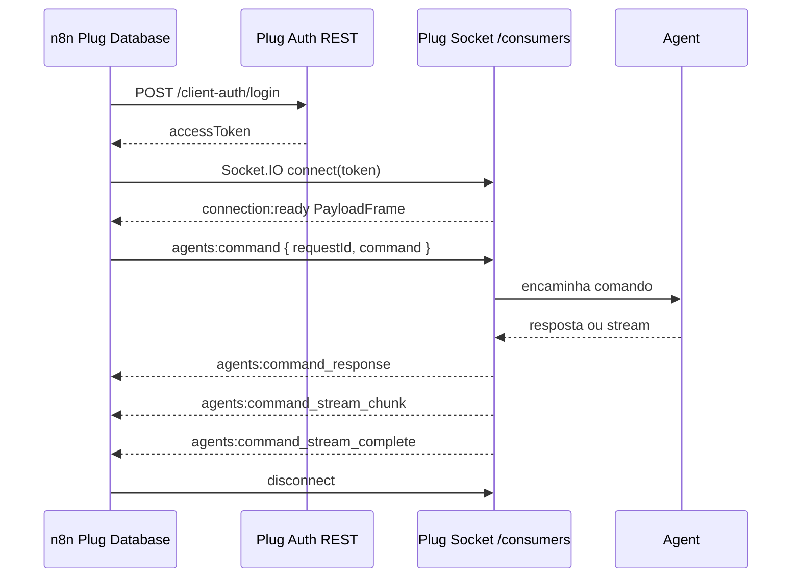

# SQL Via Socket

`Plug Database` executa comandos SQL via Socket quando:

- `Resource = SQL`
- `Channel = Socket`
- a operação selecionada é compatível com Socket

O node autentica por REST, abre uma conexão Socket.IO no namespace `/consumers`, aguarda `connection:ready` e envia o comando pelo evento `agents:command`.

## Operações Compatíveis

Na versão 1 do node, Socket está disponível para:

- `Validate Context`
- `Execute SQL`
- `Cancel SQL`
- `Discover RPC`
- `Get Agent Profile`
- `Get Client Token Policy`

Na versão 2, `Execute Batch` também pode usar Socket quando o servidor suporta `agents:command`.

## Recursos fora deste guia

`Channel = Socket` aplica-se apenas a **`Resource = SQL`**. Operações em **Client Access**, **User Access** e **Tools** usam REST (ou fluxos Socket próprios, como _Publish_ / _Wait_ / trigger), não o canal SQL descrito aqui.

Lista canónica de operações do pacote: [README do pacote `n8n-nodes-plug-database`](../../packages/n8n-nodes-plug-database/README.md#supported-operations).

## Fluxo



## PayloadFrame

`connection:ready` e o tráfego que usa o codec partilhado passam por `PayloadFrame` (descompactação, limites e HMAC quando aplicável). O comando enviado também respeita preferências de compressão do frame (`default`, `none`, `always`). Detalhe do envelope, limites locais e erros típicos: [PayloadFrame](./payload-frame.md).

## Response Mode

`Response Mode` controla como a resposta chega ao n8n:

- `Aggregated JSON`: padrão. Linhas SQL viram itens quando possível; outros retornos viram JSON agregado.
- `Chunk Items`: útil para streams SQL via Socket. Chunks são convertidos em itens sem esperar montar tudo em uma lista única.
- `Raw JSON-RPC`: preserva o envelope RPC normalizado para depuração e fluxos avançados.

Se `Chunk Items` for usado em uma combinação que não produz stream, a execução cai para saída agregada.

## Buffer e Pull

Para streams grandes, o runtime aplica limites locais:

- máximo de itens de chunk em buffer
- máximo de linhas em buffer
- máximo de bytes agregados
- janela máxima de pull de stream

Esses limites evitam que um workflow consuma memória indefinidamente quando o agente retorna muito dado ou quando o consumidor demora para processar chunks.

## Fallback

O node prefere `agents:command` para `Channel = Socket`. Para fluxos de comando único, quando o servidor não responde ao transporte novo, a implementação pode usar o fluxo legado de relay. `Execute Batch` via Socket exige `agents:command`; se o servidor não suportar, use REST ou atualize o servidor.

## Metadados de Saída

Com `Include Plug Metadata = true`, a saída inclui `json.__plug` com metadados seguros, por exemplo:

```json
{
  "__plug": {
    "channel": "socket",
    "socketMode": "agentsCommand",
    "agentId": "agent-1",
    "requestId": "request-1"
  }
}
```

Os metadados não incluem SQL, tokens, senha, `clientToken` ou payloads binários.
