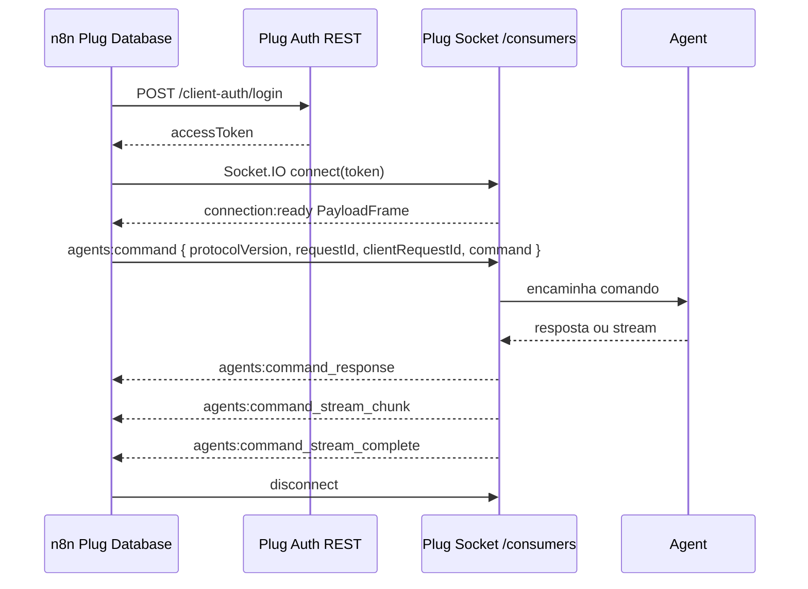

# SQL Via Socket

`Plug Database` executa comandos SQL via Socket quando:

- `Resource = SQL`
- `Channel = Socket`
- a operação selecionada é compatível com Socket

O node autentica por REST, abre uma conexão Socket.IO no namespace `/consumers`, aguarda `connection:ready` e envia o comando pelo evento `agents:command`.

## Operações Compatíveis

> **Nota sobre versões**: a "versão" abaixo refere-se ao `typeVersion` do nó `Plug Database` no n8n, não à versão do pacote npm. O `typeVersion 2` é o padrão em workflows novos desde o pacote 2.0.0; o `typeVersion 1` continua suportado para compatibilidade com workflows criados antes da consolidação.

No `typeVersion 1` do nó, Socket está disponível para:

- `Validate Context`
- `Execute SQL`
- `Cancel SQL`
- `Discover RPC`
- `Get Agent Profile`
- `Get Client Token Policy`

No `typeVersion 2` (padrão atual), `Execute Batch` também pode usar Socket quando o servidor suporta `agents:command`.

## Recursos fora deste guia

`Channel = Socket` aplica-se apenas a **`Resource = SQL`**. Operações em **Client Access**, **User Access** e **Tools** usam REST (ou fluxos Socket próprios, como _Publish_ / _Wait_ / trigger), não o canal SQL descrito aqui.

Lista canónica de operações do pacote: [README do pacote `n8n-nodes-plug-database`](../../packages/n8n-nodes-plug-database/README.md#supported-operations).

## Fluxo



## Correlação de comando

Cada `agents:command` enviado pelo node inclui um `requestId` no envelope. Para comandos únicos com `command.id` preenchido, o node usa `String(command.id)` como `requestId`; para notificações, probes e batch, o node gera um UUID local. `clientRequestId` é enviado com o mesmo valor para facilitar compatibilidade durante a transição.

O runtime só aceita `agents:command_response`, `agents:command_stream_chunk`, `agents:command_stream_complete` e `agents:stream_pull_response` que correspondem ao `requestId` e ao `streamId` ativos. Respostas atrasadas ou pertencentes a outra execução são ignoradas.

Para comando único, se um servidor antigo não ecoar a correlação esperada, o node pode cair para o fluxo legado de relay. Para `Execute Batch`, o servidor precisa responder com `requestId` correlacionado no transporte `agents:command`; caso contrário, use REST ou atualize o servidor.

## Contrato mínimo do servidor

Para compatibilidade com `agents:command`, o servidor deve cumprir estes pontos:

| Evento                           | Requisito                                                                                                                                                              |
| -------------------------------- | ---------------------------------------------------------------------------------------------------------------------------------------------------------------------- |
| `agents:command`                 | Receber envelope com `protocolVersion`, `requestId`, `clientRequestId`, `agentId`, `command`, `timeoutMs` e `payloadFrameCompression`.                                 |
| `agents:command_response`        | Ecoar `requestId` no sucesso; em stream, também enviar `streamId`. Falhas devem incluir `error.code` e `error.message`, e podem incluir `requestId` quando disponível. |
| `agents:stream_pull`             | Receber `requestId`, `streamId` e `windowSize`.                                                                                                                        |
| `agents:stream_pull_response`    | Ecoar `requestId`, `streamId` e `windowSize` positivo no sucesso.                                                                                                      |
| `agents:command_stream_chunk`    | Enviar `request_id` e `stream_id` do stream ativo.                                                                                                                     |
| `agents:command_stream_complete` | Enviar `request_id`, `stream_id` e `terminal_status`.                                                                                                                  |
| `connect_error` / `app:error`    | Usar códigos estáveis como `TOKEN_EXPIRED`, `INVALID_TOKEN`, `ACCOUNT_BLOCKED` e `AGENT_ACCESS_REVOKED` para permitir reconnect ou encerramento correto.               |

O node ignora mensagens que não batem com a correlação ativa. Isso protege execuções concorrentes e respostas atrasadas, mas exige que batch e stream usem `requestId`/`streamId` corretamente.

## PayloadFrame

`connection:ready` e o tráfego que usa o codec partilhado passam por `PayloadFrame` (descompactação, limites e HMAC quando aplicável). O comando enviado também respeita preferências de compressão do frame (`default`, `none`, `always`). Detalhe do envelope, limites locais e erros típicos: [PayloadFrame](./payload-frame.md).

## Response Mode

`Response Mode` controla como a resposta chega ao n8n:

- `Aggregated JSON`: padrão. Linhas SQL viram itens quando possível; outros retornos viram JSON agregado.
- `Chunk Items`: útil para streams SQL via Socket. Chunks são convertidos em itens sem esperar montar tudo em uma lista única.
- `Raw JSON-RPC`: preserva o envelope RPC normalizado para depuração e fluxos avançados.

Se `Chunk Items` for usado em uma combinação que não produz stream, a execução cai para saída agregada.

## Buffer e Pull

Para streams grandes, o runtime aplica limites locais:

| Limite                  | Valor padrão | Unidade         |
| ----------------------- | ------------ | --------------- |
| `maxBufferedChunkItems` | 512          | chunks          |
| `maxBufferedRows`       | 50 000       | linhas SQL      |
| `maxBufferedBytes`      | 8 MiB        | bytes estimados |
| Janela máxima de pull   | 1 000        | chunks por pull |

Quando qualquer limite é ultrapassado, a execução falha com `SOCKET_BUFFER_LIMIT`. As ações recomendadas são: reduzir `Max Rows` na query, paginar o resultado ou usar `Chunk Items`.

Esses limites evitam que um workflow consuma memória indefinidamente quando o agente retorna muito dado ou quando o consumidor demora para processar chunks.

### Janela de pull adaptiva

O tamanho da janela de pull não é fixo. O runtime lê as dicas de janela enviadas pelo servidor no `connection:ready` (`recommendedStreamPullWindowSize`, `maxStreamPullWindowSize`) e ajusta o tamanho automaticamente. A prioridade é:

1. Valor configurado manualmente no node (quando disponível)
2. Valor recomendado pelo servidor (do `connection:ready`)
3. Máximo permitido pelo servidor (teto)
4. Padrão local como fallback

O teto absoluto do cliente é 1 000 chunks por pull. Quando o servidor envia um `maxStreamPullWindowSize` menor, esse valor vence.

## Timeouts

O node trabalha com dois timeouts distintos:

- **`commandTimeoutMs`** — tempo máximo aguardando a resposta completa após o comando ser enviado. Configurado via `Timeout (MS)` no node.
- **`connectTimeoutMs`** — tempo máximo aguardando o `connection:ready`. O valor padrão é 10 s, mas é **sempre limitado ao `commandTimeoutMs`**. Se `Timeout (MS)` for 5 s, o connect timeout também é 5 s, não 10 s.

> **Idle timer, não wall-clock:** o timer de comando é um _idle timer_ que se reinicia a cada evento recebido (chunk, resposta, pull ACK). Um stream lento que envia um chunk a cada 29 s com `Timeout = 30 s` nunca expira, porque cada chunk reinicia o contador. O `commandTimeoutMs` representa o tempo máximo de silêncio, não a duração total da operação.

Para streams muito longos, se quiser um limite de duração total, aplique-o fora do node (por exemplo, via nó `Wait` ou lógica de abort no workflow).

## Fallback

O node prefere `agents:command` para `Channel = Socket`. Para fluxos de comando único, quando o servidor não responde ao transporte novo ou não devolve resposta correlacionada, a implementação pode usar o fluxo legado de relay. `Execute Batch` via Socket exige `agents:command` com correlação por `requestId`; se o servidor não suportar, use REST ou atualize o servidor.

## Metadados de Saída

Com `Include Plug Metadata = true`, a saída inclui `json.__plug` com metadados seguros, por exemplo:

```json
{
  "__plug": {
    "channel": "socket",
    "socketMode": "agentsCommand",
    "agentId": "agent-1",
    "requestId": "request-1"
  }
}
```

Os metadados não incluem SQL, tokens, senha, `clientToken` ou payloads binários.
